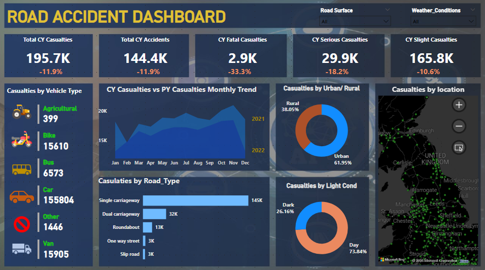

# 🚦 UK Road Accident Dashboard (2021–2022)

## 📊 Project Overview
This interactive dashboard provides insights into road accidents and casualties across the United Kingdom for the years 2021–2022. Users can explore accident trends, severity, vehicle types, environmental factors, and geographic distributions to better understand road safety patterns.

---
## Dataset: https://www.kaggle.com/datasets/saurabhshahane/road-traffic-accidents

---

## 🚦 UK Accident Dashboard

---

## 📈 Key Metrics (2021–2022)
| Metric | Value | Change vs Previous Year (PY) |
|--------|-------|-----------------------------|
| Total Casualties (CY) | 195.7K | -11.9% |
| Total Accidents (CY) | 144.4K | -11.9% |
| Fatal Casualties (CY) | 2.9K | -33.3% |
| Road Surface Casualties | 29.9K | -18.2% |
| Slight Casualties (CY) | 165.8K | -10.6% |

> **Note:** CY = Current Year, PY = Previous Year

---

## 🎯 Dashboard Features

### Visualizations
- **Monthly Trend Analysis:** Compare current year vs previous year casualties month by month.
- **Vehicle Type Breakdown:** Casualties by cars, vans, buses, agricultural vehicles, and others.
- **Urban vs Rural Distribution:** 61.95% urban vs 38.05% rural.
- **Road Type Analysis:** Single/dual carriageways, roundabouts, one-way streets, slip roads.
- **Light Conditions:** Daytime (73.84%) vs nighttime (26.16%) accidents.
- **Geographic Heatmap:** Visual representation of casualty density across UK regions.

### Data Attributes
- Accident date, time, and location
- Junction type and control (traffic lights, stop signs, etc.)
- Accident severity (Slight, Serious, Fatal)
- Weather and road surface conditions
- Vehicle types and casualty counts
- Urban/rural classification

---

## 🛠 Tech Stack
- **Data Processing:** Python (Pandas, NumPy)  
- **Visualization:** Plotly, Matplotlib, Seaborn  
- **Dashboard Framework:** Streamlit (optional)  
- **Data Source:** UK Traffic Accident Data (2021–2022)  

---

## 📁 Project Structure
